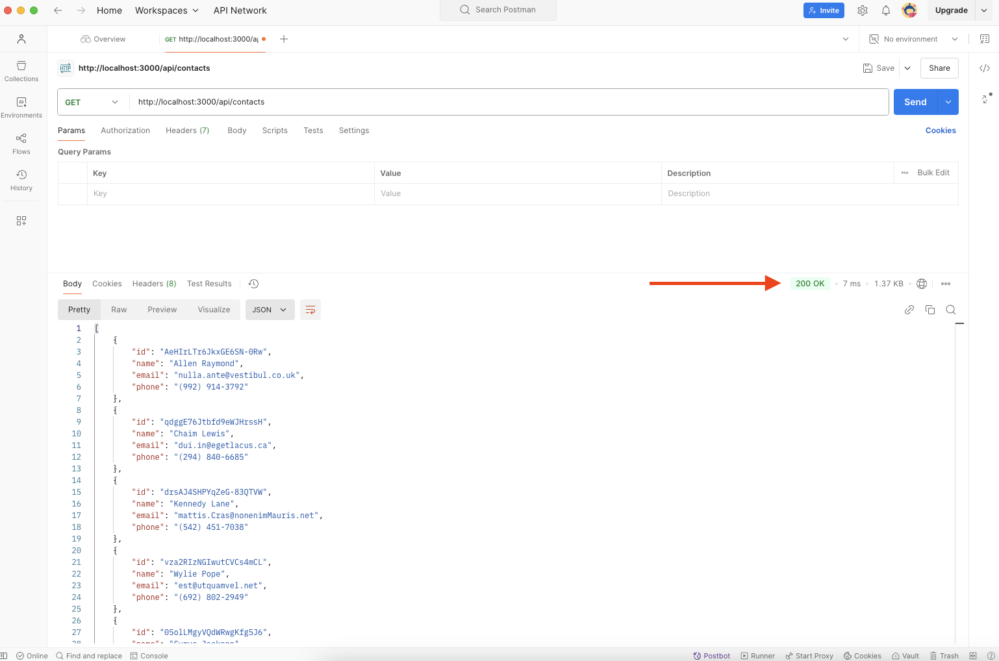
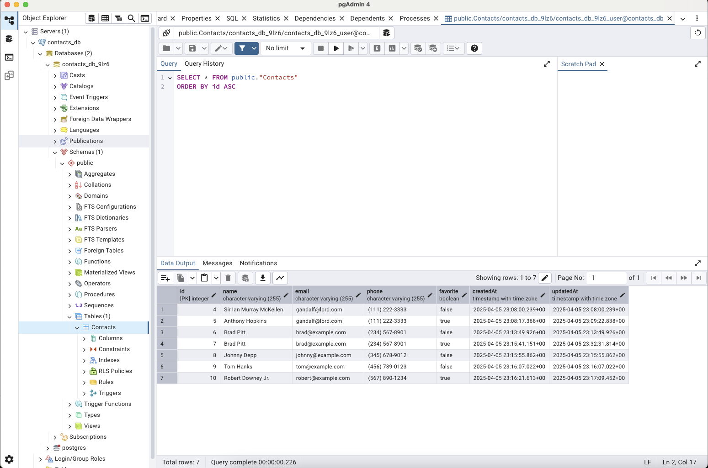
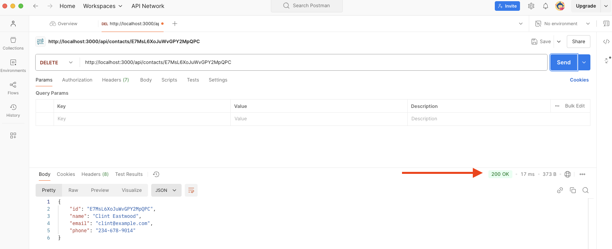
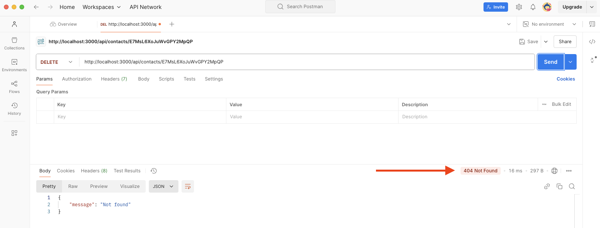
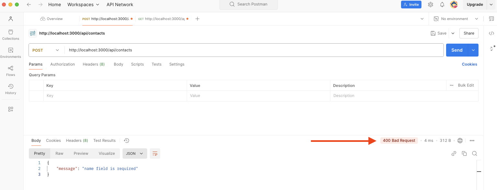
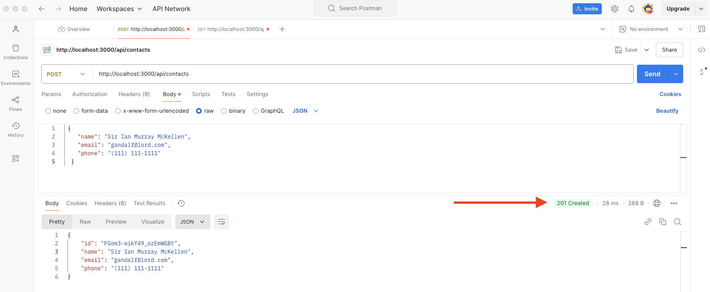
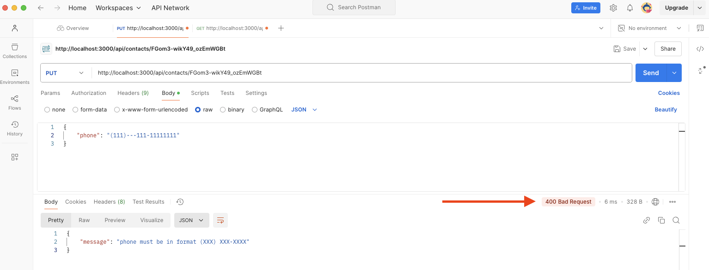
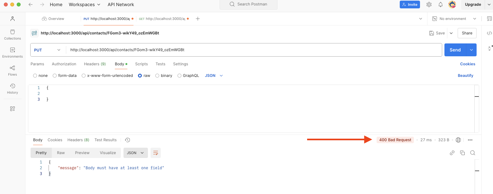
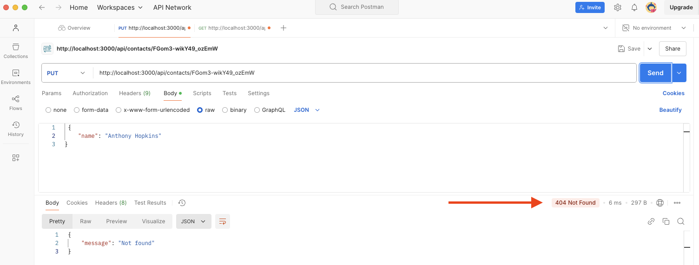

# Домашнє завдання. Тема 4. REST API

Написати REST API для роботи з колекцією контактів. Для роботи з REST API
використовуй [Postman] .

Крок 1

Cтвори репозиторій з назвою goit-node-rest-api і помісти на головну гілку (main)
файли з папки src. Завваж: папки src в репозиторії бути не повинно, тебе
цікавить лише її вміст. Створи гілку hw02-express з гілки main. Встанови модулі
командою

npm i

Крок 2

У файл contactsServices.js (знаходиться в папці services) скопіюй функції з
файла contacts.js з домашнього завдання до модуля 1.

Крок 3

Напиши контролери у файлі contactsControllers.js (знаходиться у папці
controllers) з урахуванням наведених нижче вимог.

REST API повинен підтримувати такі раути:

GET /api/contacts

Викликає функцію-сервіс listContacts для роботи з json-файлом contacts.json
Повертає масив всіх контактів в json-форматі зі статусом 200

GET /api/contacts/:id

Викликає функцію-сервіс getContactById для роботи з json-файлом contacts.json
Якщо контакт за id знайдений, повертає об'єкт контакту в json-форматі зі
статусом 200 Якщо контакт за id не знайдено, повертає json формату {"message":
"Not found"} зі статусом 404

DELETE /api/contacts/:id

Викликає функцію-сервіс removeContact для роботи з json-файлом contacts.json
Якщо контакт за id знайдений і видалений, повертає об'єкт видаленого контакту в
json-форматі зі статусом 200 Якщо контакт за id не знайдено, повертає json
формату {"message": "Not found"} зі статусом 404

POST /api/contacts

Отримує body в json-форматі з полями {name, email, phone}. Усі поля є
обов'язковими - для валідації створи у файлі contactsSchemas.js (знаходиться у
папці schemas) схему з використаням пакета joi Якщо в body немає якихось
обов'язкових полів (або передані поля мають не валідне значення), повертає json
формату {"message": error.message} (де error.message - змістовне повідомлення з
суттю помилки) зі статусом 400 Якщо body валідне, викликає функцію-сервіс
addContact для роботи з json-файлом contacts.json, з передачею їй даних з body
За результатом роботи функції повертає новостворений об'єкт з полями {id, name,
email, phone} і статусом 201

PUT /api/contacts/:id

Отримує body в json-форматі з будь-яким набором оновлених полів (name, email,
phone) (всі поля вимагати в боді як обов'язкові не потрібно: якщо якесь із полів
не передане, воно має зберегтись у контакта зі значенням, яке було до оновлення)
Якщо запит на оновлення здійснено без передачі в body хоча б одного поля,
повертає json формату {"message": "Body must have at least one field"} зі
статусом 400. Передані в боді поля мають бути провалідовані - для валідації
створи у файлі contactsSchemas.js (знаходиться у папці schemas) схему з
використанням пакета joi. Якщо передані поля мають не валідне значення, повертає
json формату {"message": error.message} (де error.message - змістовне
повідомлення з суттю помилки) зі статусом 400 Якщо з body все добре, викликає
функцію-сервіс updateContact, яку слід створити в файлі contactsServices.js
(знаходиться в папці services). Ця функція має приймати id контакта, що підлягає
оновленню, та дані з body, і оновити контакт у json-файлі contacts.json За
результатом роботи функції повертає оновлений об'єкт контакту зі статусом 200.
Якщо контакт за id не знайдено, повертає json формату {"message": "Not found"}
зі статусом 404

Зверни увагy

Валідацію body можна як здійснювати у контролері, так і створити для цих цілей
окрему міддлвару, яка буде викликатись до контролера. Для створення міддлвари
можеш скористатись функцією validateBody.js, яку знайдеш у папці helpers Для
роботи з помилками можна скористатись функцією HttpError.js, яку знайдеш у папці
helpers

Якщо вказані функції використовувати не будеш, видали їх з проєкту перед тим, як
надсилатимеш роботу на перевірку ментору

Критерії прийому

Створено репозиторій з домашнім завданням Посилання на репозиторій (гілку з
домашнім завданням) надіслане ментору на перевірку Код відповідає технічному
завданню (мають бути в точності дотримані, зокрема, вимоги стосовно струкутри
body, контенту та статусу відповідей на запити тощо) У коді немає закоментованих
ділянок коду Проєкт коректно працює з актуальною LTS-версією Node

Формат здачі

Домашня робота містить два посилання: на вихідні файли (посилання на репозиторій
з кодом). Прикрiплений файл репозиторію у форматi zip. ☝ ВАЖЛИВО Переглянь
Iнструкцію щодо завантаження робочого файлу з репозиторію на Github

Формат оцінювання

Оцiнка вiд 0 до 100

Градацiя балів

Загальний максимум - 100 балiв

Крок 2 — 5 балів

У файл contactsServices.js (знаходиться в папці services) скопійовано функції з
файла contacts.js з домашнього завдання до теми 2. Крок 3 — 5 балів

Написано контролери у файлі contactsControllers.js (знаходиться у папці
controllers) з урахуванням наведених нижче вимог. GET /api/contacts — 10 балів

Виклик функції-сервісу listContacts для роботи з json-файлом contacts.json .
Повернення масиву всіх контактів в json-форматі зі статусом 200 . GET
/api/contacts/ — 15 балів

Виклик функції-сервісу getContactById для роботи з json-файлом contacts.json .
Повернення об'єкта контакту за id в json-форматі зі статусом 200 . Повернення
json з повідомленням {"message": "Not found"} зі статусом 404, якщо контакт за
id не знайдено . DELETE /api/contacts/ — 15 балів

Виклик функції-сервісу removeContact для роботи з json-файлом contacts.json .
Повернення об'єкта видаленого контакту в json-форматі зі статусом 200 .
Повернення json з повідомленням {"message": "Not found"} зі статусом 404, якщо
контакт за id не знайдено . POST /api/contacts — 25 балів

Валідація body з полями {name, email, phone} з використанням пакета joi у файлі
contactsSchemas.js . Повернення json з повідомленням {"message": error.message}
зі статусом 400, якщо відсутні обов'язкові поля або передані поля мають не
валідне значення . Виклик функції-сервісу addContact для роботи з json-файлом
contacts.json . Повернення новоствореного об'єкта з полями {id, name, email,
phone} і статусом 201. PUT /api/contacts/ — 25 балів

Валідація body з будь-яким набором оновлених полів (name, email, phone) з
використанням пакета joi у файлі contactsSchemas.js . Повернення json з
повідомленням {"message": "Body must have at least one field"} зі статусом 400,
якщо запит на оновлення здійснено без передачі в body хоча б одного поля .
Повернення json з повідомленням {"message": error.message} зі статусом 400, якщо
передані поля мають не валідне значення . Виклик функції-сервісу updateContact
для оновлення контакту у файлі contacts.json . Повернення оновленого об'єкта
контакту зі статусом 200 . Повернення json з повідомленням {"message": "Not
found"} зі статусом 404, якщо контакт за id не знайдено .

Подробиці оцінювання:

Кожен раут оцінюється окремо, включаючи валідацію, виклик функцій-сервісів та
обробку помилок. Додаткові бали надаються за використання міддлвари та функції
для обробки помилок, а також за загальну відповідність коду вимогам завдання.

За що можуть бути зняті бали в рамках перевiрки кожного з некоректно
реалізованих пунктiв, зазначених вище:

критична помилка - мінус 5 балів незначна помилка - мінус 2 бали

Особливостi прийняття домашнього завдання

Критерії прийняття домашнього завдання є обов’язковою умовою оцінювання
домашнього завдання ментором. Якщо якийсь з критеріїв НЕ виконано, ДЗ
відправляється ментором на доопрацювання без оцінювання.

Якщо вам “тільки уточнити”😉 або ви “застопорилися” на якомусь з етапів
виконання— звертайтеся до ментора у Slack)

🚨 УВАГА!!

У вас є можливість обрати підхід до виконання та можливого доопрацювання
домашнього завдання:

Задовольнитися першою отриманою оцінкою (звісно ж, якщо вона вище прохідного
бала), Намагатися отримати вищий бал шляхом можливого послідуючого доопрацювання
роботи у відповідності з фідбеком ментора. Обраний підхід до виконання ДЗ за
бажанням студент зазначає у коментарі в полі для здачі домашнього завдання. За
відсутності коментаря ментор дотримується першого підходу й виставляє отриману
оцінку.

📌 Якщо є помилки або недоліки виконання, кількість балів на кожному етапі
зменшується пропорційно до наявних помилок на розсуд ментора.

Відправляйте ДЗ на перевірку, коли зроблено все можливе, оскільки кількість
спроб здачі завдання впливає на отриманий бал!

За кожну наступну спробу після другої (тобто з третьої) максимальна можлива
кількість балів зменшується на 5.

Критерії оцінювання робіт у магістратурі GoIt Neoversity

Пам'ятайте, що виконання всіх вимог та рекомендацій є важливим для успішного
завершення домашнього завдання.

Бажаємо успіху у роботі!

### Результат виконаного ДЗ

#### Завдання 1

#### Завдання 2

#### Завдання 3

#### Завдання 4

#### Завдання 5

#### Завдання 6

#### Завдання 7

#### Завдання 8

#### Завдання 9

#### Завдання 10

#### Завдання 11

